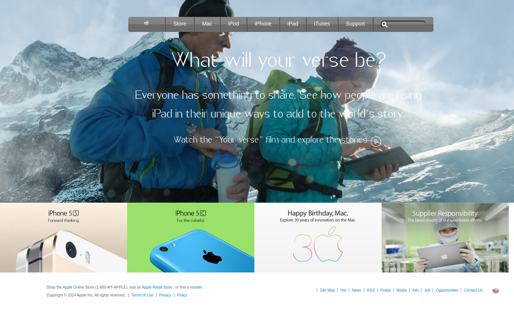

# BUILDING WITH BACKGROUNDS AND GRADIENTS: apple clone web page
In this project I have cloned the website of one of the most design-forward companies in the world.

The goal here is to use background photos well and the navbar at the top contains a gradient.

# Built With
* HTML
* CSS

# Live Demo
**[Live Demo](https://raw.githack.com/rindrajosia/apple-clone/feature-one/index.html)**

# Getting Started
To use it locally, you need to :
1. Fork the repository to your GitHub account.
2. Choose a local folder for the cloned files.
3. Clone the repository to your local machine.
4. Double click on 'index.html'.

# Authors

**Gabrie Lhilarion**

* Github: **[@gabrie-lhilarion](https://github.com/gabrie-lhilarion)**
* Twitter: **[@gabrielDeman](https://www.twitter.com/gabrielDeman)**
* Linkedin: **[linkedin](https://www.linkedin.com/in/gabrielhilarion/)**

**Rindra Josia**

* Github: **[@rindrajosia](https://github.com/rindrajosia)**
* Twitter: **[@rindrajosia](https://twitter.com/josia_rindra)**
* Linkedin: **[linkedin](https://www.linkedin.com/in/rindra-josia-99b2111a2/)**

#  Contributing

Contributions, issues and feature requests are welcome!
Feel free to check the **[issues](https://github.com/rindrajosia/mint-clone/issues)** page.

#  Show your support

  Give ⭐️ if you like this project!

# Acknowledgments

* mint.com
* Microverse
* Contributors
